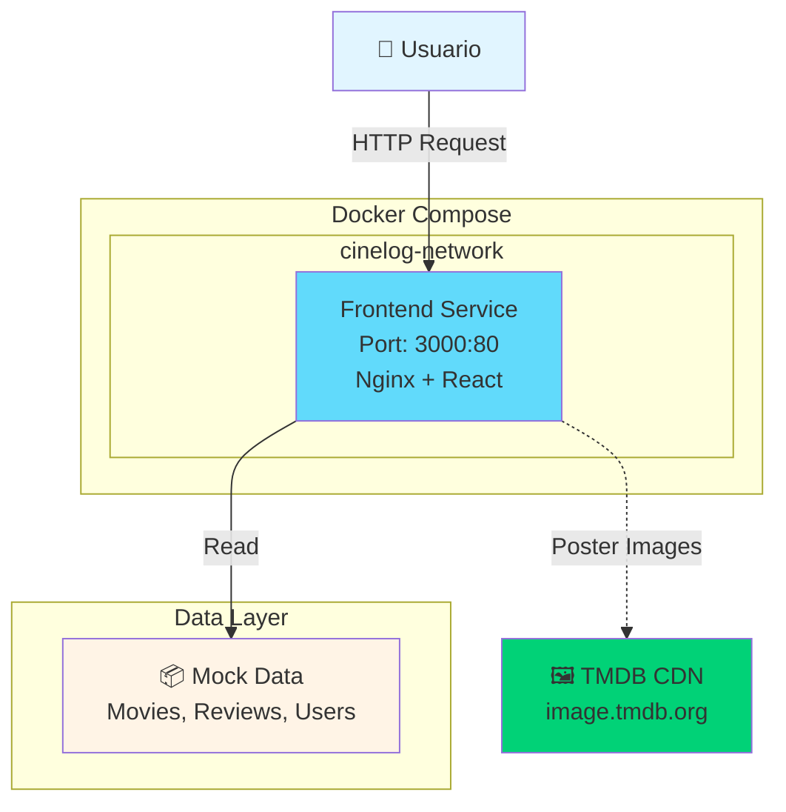

# Arquitectura del Sistema CineLog

## Diagrama de Servicios


## Componentes

### Frontend Service
- **Contenedor**: cinelog-frontend
- **Tecnología**: React + TypeScript + Vite
- **Web Server**: Nginx Alpine
- **Puerto**: 3000 (host) → 80 (container)
- **Función**: SPA para gestión de películas y reseñas

### Data Layer
- **Tipo**: Mock data (seed data)
- **Ubicación**: Cliente (estado de React)
- **Entidades**:
  - `seedMovies`: 8 películas precargadas
  - `Users`: Datos de usuarios mockeados
  - `Reviews`: Reseñas de películas mockeadas
- **Persistencia**: LocalStorage / Estado en memoria

### External Dependencies
- **TMDB CDN**: Solo para imágenes de posters
  - URL: `https://image.tmdb.org/t/p/w780/`
  - No requiere API key
  - Conexión de solo lectura (GET)

## Docker Compose Configuration

### Services
**frontend**: Aplicación React servida por Nginx
- Build desde Dockerfile local con multi-stage
- Expone puerto 3000:80
- Health checks cada 30s
- Restart policy: unless-stopped
- Datos mock incluidos en el bundle

### Networks
**cinelog-network**: Red bridge
- Driver: bridge
- Preparada para futura expansión con backend

### Volumes
**nginx-logs**: Persistencia de logs
- Driver: local
- Path: `/var/log/nginx`
- Útil para debugging

## Variables de Entorno

| Variable | Descripción | Valor por defecto |
|----------|-------------|-------------------|
| `FRONTEND_PORT` | Puerto externo del frontend | `3000` |
| `NODE_ENV` | Entorno de ejecución | `production` |

## Flujo de Datos
```
1. Usuario accede a localhost:3000
   ↓
2. Nginx sirve la SPA de React
   ↓
3. React carga mock data (seedMovies, users, reviews)
   ↓
4. Se muestran posters desde TMDB CDN
   ↓
5. Usuario interactúa con la aplicación
   ↓
6. Cambios se guardan en estado local / LocalStorage
```

## Arquitectura Actual vs Futura

### Fase 1: Actual (DevOps Practice)
```
[Usuario] → [Frontend Container] → [Mock Data en cliente]
              ↓ (solo imágenes)
           [TMDB CDN]
```

**Características:**
- ✅ Totalmente funcional sin backend
- ✅ Datos mockeados incluidos en el bundle
- ✅ Sin necesidad de base de datos
- ✅ Imágenes desde CDN público

### Fase 2: Futura (Full Stack)
```
[Usuario] → [Frontend] → [Backend API] → [Database]
                            ↓
                      [TMDB API v3]
                      (búsqueda de películas)
```

**Mejoras planeadas:**
- Backend REST API (Node.js/Express)
- Base de datos PostgreSQL
- Autenticación JWT
- Integración completa con TMDB API
- Persistencia real de reviews y usuarios

## Ventajas de la Arquitectura Actual

1. **Simplicidad**: Sin dependencias de backend/DB
2. **Portabilidad**: Un solo contenedor, fácil de desplegar
3. **Demo-ready**: Funciona inmediatamente sin configuración
4. **DevOps Focus**: Perfecto para practicar containerización y CI/CD
5. **Escalable**: Diseño preparado para agregar backend

## Comandos de Deployment
```bash
# Build y levantar
docker-compose up -d

# Ver logs
docker-compose logs -f frontend

# Acceder
open http://localhost:3000

# Detener
docker-compose down
```

## Seguridad

- ✅ Sin credenciales ni API keys requeridas
- ✅ Imágenes desde CDN público (sin autenticación)
- ✅ Variables de entorno en `.env` (no commiteado)
- ✅ Red aislada para futura expansión
- ✅ Health checks para alta disponibilidad